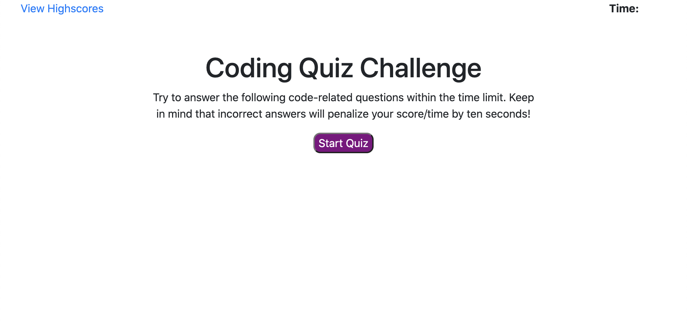

# code_quiz
This is a JavaScript Code Quiz. You have 60 seconds to make it through all of the multiple choice questions. If you choose the wrong answer, 15 seconds will be taken off the timer. Your final score is the time you have left on the timer when you are finished. Enter your initials, and the application will take you to a high scores page that lists the top 3 high scores where you can go back and try again or erase the top scores stored in localStorage. This program utilizes DOM manipulation, event listeners, functions, if and else statements, loops, local storage, and many other JavaScript concepts. The HTML, CSS, and JavaScript have been checked though validation services.

[Click Here to check it out!](https://jacoblovins.github.io/code_quiz/)

